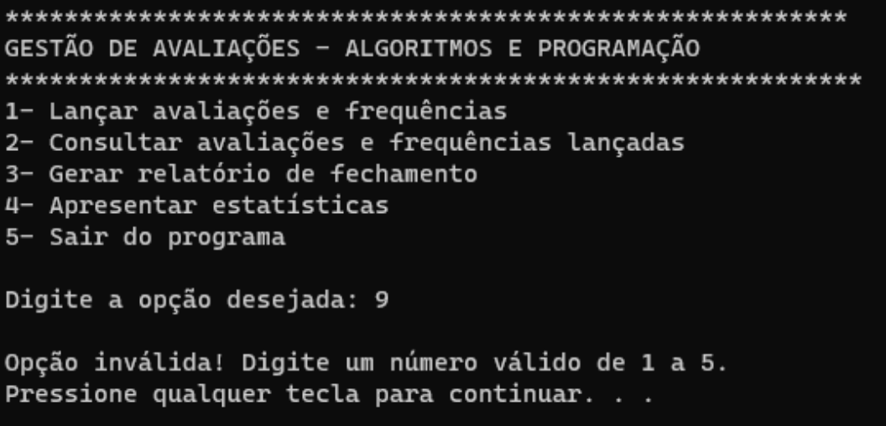
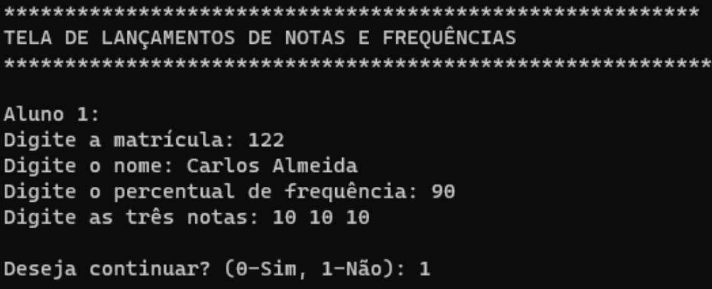
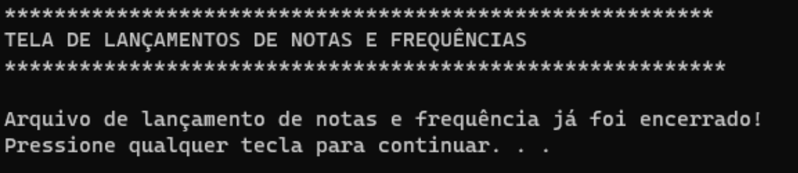
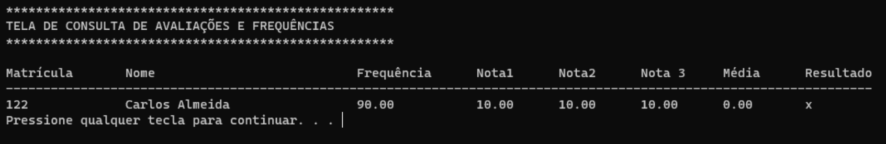
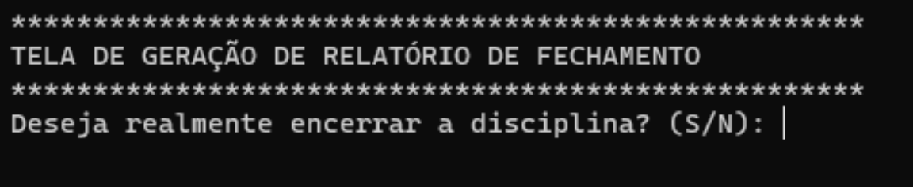
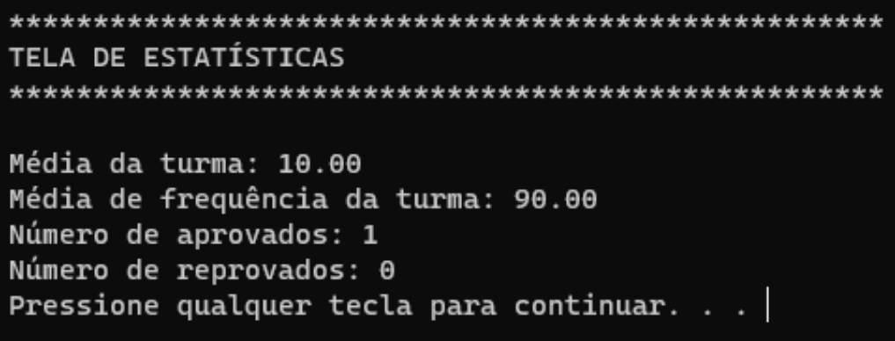
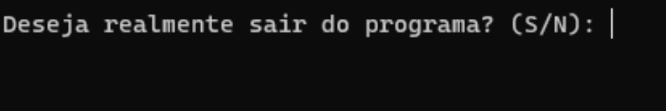

# gestaoDeNotas

## Projeto de programa em C para a gestão de avaliações na em uma disciplina, onde: 


* O sistema inicia pela tela do menu principal que exibe um cabeçalho com nome do sistema e opções do menu

``` 
***************************************************************************************************  
                         GESTÃO DE AVALIAÇÕES - ALGORITMOS E PROGRAMAÇÃO 
*************************************************************************************************** 
1- Lançar avaliações e frequências
2- Consultar avaliações e frequências lançadas
3- Gerar relatório de fechamento
4- Apresentar estatísticas
5- Sair do programa
```
<br>



<br>

* A função da opção 2 é exibir na tela os lançamentos de notas e frequências já realizados pelos alunos cadastrados. Onde o programa lê os dados armazenados no arquivo "lancamentos.txt" e exibe-os na tela. Isso é feito através da abertura do arquivo em modo de leitura, a leitura dos dados linha por linha, o processamento e formatação dos dados lidos, e a exibição dos dados formatados na tela.
<br>



<br>



<br>



<br>


* A função da opção 3 é gerar um relatório de fechamento da disciplina. Isso envolve a leitura dos dados de lançamentos do arquivo "lancamentos.txt", o cálculo da média ponderada e do resultado de cada aluno, a escrita dos dados processados em um novo arquivo "relatorio.txt" e a marcação da disciplina como encerrada. O relatório de fechamento contém informações como a matrícula, nome, frequência, notas, média e resultado de cada aluno.

<br>



<br>


* A função da opção 4 é apresentar estatísticas da disciplina, com base nos dados do relatório de fechamento gerado anteriormente. Isso envolve a leitura dos dados do arquivo "relatorio.txt", o cálculo da média da turma, média de frequência da turma, número de alunos aprovados e número de alunos reprovados. As estatísticas são exibidas na tela, incluindo o total de alunos, o número de alunos aprovados, o número de alunos reprovados e a média geral da turma. Após fechar o relatório, não será mais possível lançar novas avaliações e frequências, pois a disciplina está encerrada. Ao selecionar a opção 1 - "Lançar avaliações e frequências", o programa exibirá uma mensagem informando que a disciplina já foi encerrada.

<br>



<br>



<br>

Além disso, ao gerar o relatório de fechamento, os dados dos alunos serão processados e gravados no arquivo "relatorio.txt". Ao selecionar a opção 3 - "Gerar relatório de fechamento" novamente, o programa exibirá uma mensagem informando que o relatório já foi gerado anteriormente.

<br>

## TECNICALIDADES

`struct Aluno`: Define uma estrutura Aluno que armazena informações sobre cada aluno, incluindo matrícula, nome, frequência, notas, média e resultado (aprovado ou reprovado).

`alunos[100]` , `totalAlunos` e `disciplinaEncerrada` : Variáveis globais que armazenam um array de alunos, o total de alunos registrados e uma flag indicando se a disciplina foi encerrada.

`limparTela()`: Função que limpa a tela do console.

`pausar()`: Função que pausa a execução do programa até que o usuário pressione Enter.

`exibirMenuPrincipal()`: Função que exibe o menu principal do programa, mostrando as opções disponíveis.

`lancarAvaliacoes()`: Função que permite ao usuário lançar as avaliações e frequências de um aluno. Ela solicita a matrícula, nome, frequência e notas do aluno, calcula a média e determina o resultado (aprovado ou reprovado). Os dados do aluno são armazenados no array alunos e também são registrados em um arquivo "lancamentos.txt".

`exibirLancamentos()`: Função que exibe os lançamentos de notas e frequências já realizados. Ela lê o conteúdo do arquivo "lancamentos.txt" e exibe os dados dos alunos registrados.

`gerarRelatorio()`: Função que gera um relatório de fechamento da disciplina. Ela solicita confirmação do usuário para encerrar a disciplina, lê os lançamentos registrados no arquivo "lancamentos.txt" e escreve um relatório formatado no arquivo "relatorio.txt". Os lançamentos são apagados do arquivo "lancamentos.txt" e a flag disciplinaEncerrada é ativada.

`apresentarEstatisticas()`: Função que apresenta estatísticas sobre os alunos registrados. Ela calcula o número de alunos aprovados, reprovados e a média geral da turma com base nos dados armazenados na estrutura Aluno e exibe essas informações na tela.

`main()`: Função principal do programa. Ela exibe o menu principal e permite ao usuário escolher uma opção. Dependendo da opção selecionada, chama as funções correspondentes. O programa continua em execução até que o usuário escolha a opção para sair.